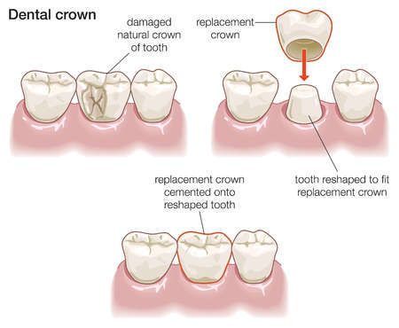
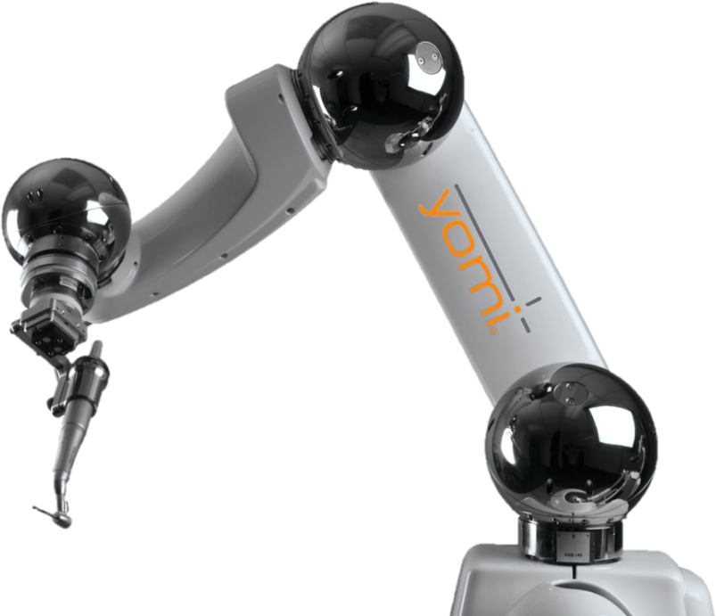

<!--
ABSTRACT
1. In tooth prep in dental surgery, it is important to acheive accuracy and speed.
2. However, dentists have done manually but the robot arm has to be commanded manually all trajectories.
3. In this paper, we would like to propose rl-based planner for dental surgery specifically tooth prep for crown
4. To automate this procedure with rl agent in simulator and impose the traj in real world to make to robot arm follow
5. how: RoboDK with robot and tool info + openAI gym for trial and error to find the best traj while avoiding various types of obstaacles in patient jaw. 
6. brief result - expected result: we will simulate and visualize in the simulation that the trajectory has been generated in 
engineer-manually hard coded trajectory 
evaluate time, accuracy and safety(obstacale avoidance etc)
hopefully run in the real robot arm for evaluation as well
Keyword, path planning, obstacle avoidance, dental surgical robotics, reinforcement learning
-->
> With advancement in robotic technologies, in the field of medical surgery, artificial intelligence and machine learning plays a pivital role in medical imaging, prognosis/diagnosis, treatment assistant, and automation of repetitive substasks of surgery. However, specifically in dental surgery, reinforcement learning has not been actively applied while it has a lot in common with robot machining where RL is widely used for fully-automated trajectory generation. Therefore, in this article, by developing RL-based tool trajectory planner, we would like to enable robot arm to automatically perform a few subtasks in dental surgery such as tooth preparation for crown through removal of cavity. We will use CopelliaSim for simulation environment, Python/Pytorch for RL, and MATLAB for robotics. The expected result of this project would be RL-based, collision-free, fully-automated dental tool trajectory generation.

<!--more-->
{}: class="table-of-content"}
* [Introduction](#introduction)
* [Background](#background)
    * [Tooth Preparation for Crown](#tooth-preparation-for-crown)
    * [Kinematics of Robotics](#kinematics-of-robotics)
    * [Reinforcement Learning](#reinforcement-learning)
* [Methodology](#methodology)
    * [Interaction Environment](#interaction-environment)
    * [Reward Function](#reward-function)
    * [Training Process](#training-process)
* [Results](#results)
    * [Experimental Setup]()
    * [Experimental Results]()
    * [Analysis and Evaluation]()
* [Conclusions](#conclusion)
* [References](#references)

## Introduction
<!--1. Dentistry industry expands, thanks to robotics tech, Status of dental surgery automation + robotics tech
(related work in dental robotics)-->
With advent of aging society and the advancement in robtic technologies, dentistry industry becomes one of the biggest market in the field of robotics. Since various surgeries in dentistry involve high-precision and repetitive tasks, robot technologies have significant potential and ability to assist dentists or perform certain types of tasks over human practioners. Many researches have been conducted applying the robot technologies to dentistry such as maxillofacial surgery [[1-3]](#reference), tooth preparation [[4]](#reference), and robot assistant [[5]](#reference).
<!--2. Also AI, but is limited in the field of diagnosis estimation assesment even though rl agent has been started in the other medical field for control(related work in dental robotics & surgical robots)
3. among many procedure, prep tooth for crown has lots in common with robot machining and many literatures exist
(related work in robot machining)-->
On top of that, along with the robotics technologies, machine learning (ML) and artificial intelligence (AI) has been used in dentistry as well. The ML and AI is often faciliated in dental imaging and diagonsis: clinical diagnosis [[6]](#reference), dental radiography [[8]](#reference), and oral cancer prediction [[9]](#reference). However, compared to other fields of surgical robots [[10-14]](#reference), reinforcement learning (RL) has not been actively applied in dentistry. For the most commonly used commercial surgical robot, da Vinchi System, open-source environment is provided for users to apply reinforcement learning algorithms for controlling the surgical arms [[10-11]](#reference). While subtasks of surgery in dentistry such as implantology and tooth preparation for crown has a lot in common with the field of robot machining where RL also has been actively studied and applied, to the best of my knowledge, there are not many researches being conducted in RL-based dental robot control.

{: style="width: 400px; max-width: 100%;"}
*Fig 1. YOLO: An object detection method in computer vision* [1].

<!--6. In this paper, we propose rl-based planner which apply rl agent take advantage of previous study in robot maching and use it for tooth prep in dental surgery
7. main contribution summary
-expand the field of roboitcs to dental surgical branch and explanation on dental surgery robotics-->
In this regard, in this article, we would like to take advantage of RL to automate subtasks in dental surgery. Specifically, we will propose rl-based trajectory planner for robot arm to accomplish automatated tooth preparation for crown. The expected contribution of our project is summarized as follow:
- Reinforcement Learning environment for dental surgical robot
- 3D CAD model based fully-automatic trajectory generation
- Guarantee of collision-free trajectory with appropriatly defined reward function and collision-check in simulation
<!--8. the rest of paper structure -->
The structure of the rest of the article is as follow: 1) background for tooth preparation for crown, kinematics of robotics, and reinforcement learning, 2) methodology we use for this project, 3) result of the simulation of rl-based trajectory planner, and 4) conclusion.
<!--
Your article starts here. You can refer to the [source code](https://github.com/lilianweng/lil-log/tree/master/_posts) of [lil's blogs](https://lilianweng.github.io/lil-log/) for article structure ideas or Markdown syntax. We've provided a [sample post](https://ucla-rlcourse.github.io/CS269-projects-2022fall/2017/06/21/an-overview-of-deep-learning.html) from Lilian Weng and you can find the source code [here](https://github.com/ucla-rlcourse/CS269-projects-2022fall/blob/main/_posts/2017-06-21-an-overview-of-deep-learning.md)-->

## Background
### Tooth Preparation for Crown
explanation on tooth preparation procedure for crown in dentistry

<!--
Please create a folder with the name of your team id under `/assets/images/`, put all your images into the folder and reference the images in your main content.

You can add an image to your survey like this:

{: style="width: 400px; max-width: 100%;"}
*Fig 1. YOLO: An object detection method in computer vision* [1].

Please cite the image if it is taken from other people's work.-->


### Kinematics of Robotics
explanation on kinematics of robotics e.g. how tool trajectory is converted into joint angles of robot arm.

<!--
Here is an example for creating tables, including alignment syntax.

|             | column 1    |  column 2     |
| :---        |    :----:   |          ---: |
| row1        | Text        | Text          |
| row2        | Text        | Text          |
-->


### Reinforcement Learning
explanation on our method of reinforment learning: MDP, DQN
<!--
```
# This is a sample code block
import torch
print (torch.__version__)
```


### Formula
Please use latex to generate formulas, such as:

$$
\tilde{\mathbf{z}}^{(t)}_i = \frac{\alpha \tilde{\mathbf{z}}^{(t-1)}_i + (1-\alpha) \mathbf{z}_i}{1-\alpha^t}
$$

or you can write in-text formula $$y = wx + b$$.

### More Markdown Syntax
You can find more Markdown syntax at [this page](https://www.markdownguide.org/basic-syntax/).
-->
## Methodology

### Interaction Environment
We will use CoppeliaSim, Python, and MATLAB for this project.


### Reward Function

### Training Process


## Results
Simulation of trajectory planner and evaluate the result by comparing it with the desired 3D CAD model.

## Conclusion

## Reference
<!--maxillofacial surgery-->
[1] Sun X, McKenzie FD, Bawab S, Li J, Yoon Y, Huang JK. "Automated dental implantation using image-guidedrobotics: registration results." Int J Comput Assist RadiolSurg 2011;6:627–34.

[2] Zhenggang C, Qin C, Fan S, Yu D, Wu Y, Chen X. "Pilot studyof a surgical robot system for zygomatic implantplacement." Med Eng Phys 2019.

[3] Woo S-Y, Lee S-J, Yoo J-Y, Han J-J, Hwang S-J, Huh K-H, et al. "Autonomous bone reposition around anatomical landmarkfor robot-assisted orthognathic surgery." J Cranio-MaxillofacSurg 2017;45:1980–8.

<!--tooth prep-->
[4] Otani T, Raigrodski A, Mancl L, Kanuma I, Rosen J. "In vitroevaluation of accuracy and precision of automated robotictooth preparation system for porcelain laminate veneers." JProsthetic Dent 2015:114.

[5] Yuan, Fusong, and Peijun Lyu. "A preliminary study on a tooth preparation robot." Advances in Applied Ceramics 119.5-6 (2020): 332-337.

<!--robot assistant-->
[6] Grischke J, Johannsmeier L, Eich L, Haddadin S. "Dentronics:first concepts and pilot study of a new application domainfor collaborative robots in dental assistance." In: 2019 international conference on robotics and automation(ICRA). 2019.

<!--radiography-->
<!--dental imaging [6], radiography [7], prediction of oral treatment [8], prognosisof oral cancer [9], etc.-->
[7] Chan Y-K, Chen Y-F, Pham T, Chang W, Hsieh M-Y. Artificialintelligence in medical applications. J Healthcare Eng2018;2018:2.

[8] Chan Y-K, Chen Y-F, Pham T, Chang W, Hsieh M-Y. Artificialintelligence in medical applications. J Healthcare Eng2018;2018:2.

[9] Wang X, Yang J, Wei C, Zhou G, Wu L, Gao Q, et al. Apersonalized computational model predicts cancer risklevel of oral potentially malignant disorders and its webapplication for promotion of non-invasive screening. J OralPathol Med 2019.

<!--rl surgical robot-->
<!--rl opensource environment-->
[10] Richter, Florian, Ryan K. Orosco, and Michael C. Yip. "Open-sourced reinforcement learning environments for surgical robotics." arXiv preprint arXiv:1903.02090 (2019).

[11] Xu, Jiaqi, et al. "Surrol: An open-source reinforcement learning centered and dvrk compatible platform for surgical robot learning." 2021 IEEE/RSJ International Conference on Intelligent Robots and Systems (IROS). IEEE, 2021.

<!--rl path planning for suturing and tissue manipulation-->
[12] Baek, Donghoon, et al. "Path planning for automation of surgery robot based on probabilistic roadmap and reinforcement learning." 2018 15th International Conference on Ubiquitous Robots (UR). IEEE, 2018.

[13] Varier, Vignesh Manoj, et al. "Collaborative suturing: A reinforcement learning approach to automate hand-off task in suturing for surgical robots." 2020 29th IEEE International Conference on Robot and Human Interactive Communication (RO-MAN). IEEE, 2020.

[14] Shin, Changyeob, et al. "Autonomous tissue manipulation via surgical robot using learning based model predictive control." 2019 International Conference on Robotics and Automation (ICRA). IEEE, 2019.


[3] Dwibedi, Debidatta, et al. "Counting out time: Class agnostic video repetition counting in the wild." Proceedings of the IEEE/CVF Conference on Computer Vision and Pattern Recognition. 2020.   

[Peng, et al.] Peng, Zhenghao, et al. "Maybe you can also use other format for reference as you wish." Nature. 2022. 

---

<!--
## Data Rich and Physics Certain

| Experiment 					| Parameters  											| Results  								| Comments 							|
| :---       					|    :----:   											|     :---: 							|     ---: 							|
| **DL + Data**																																						|

| Predicting only velocity  	| Dataset size : 10000<br> Network : 2->5->5->1 <br> activation: ReLU	|  ~100% accurate	| Generalises well over various initial velocities |
| Predicting only displacement 	| Dataset size : 10000<br> Network : 2->16->16->1 <br>	activation: ReLU |	Reasonable		| Better prediction for $u_0 \in dataset$, average prediction outside | 
| Predicting both $v_t, s_t$	| Dataset size : 10000<br> Network : 2->16->16->2 <br>	activation: tanh	|	Reasonable		| Better prediction for $u_0 \in dataset$, poor prediction outside |

-----

| **DL + Physics**																																			|
| Predicting both $v_t, s_t$, using Loss $L_{physics} = \|v_{predicted}^2-u_{initial}^2-2*g*s_{predicted}\|$ | Dataset size : 10000<br> Network : 2->16->16->1 <br>	activation: ReLU |	~0% accuracy		| Expected result as no supervision of any kind is provided |
| Predicting both $v_t, s_t$, using Loss $L_{velocity+phy} = (v_{predicted}-v_{actual})^2+\gamma*(v_{predicted}^2-u_{initial}^2-2*g*s_{predicted})^2$ | Dataset size : 10000<br> Network : 2->16->16->1 <br>	activation: ReLU |	Reasonable	| Prediction of $v_t$ is good. Was able to learn $s_t$ reasonably well without direct supervision |
| Predicting both $v_t, s_t$, using Loss $L_{supervised+phy} = (v_{predicted}-v_{actual})^2+(s_{predicted}-s_{actual})^2+\gamma*(v_{predicted}^2-u_{initial}^2-2*g*s_{predicted})^2$ | Dataset size : 10000<br> Network : 2->16->16->1 <br>	activation: ReLU |	Reasonable	| Not a better result w.r.t direct supervision |


**Observations :** 
- Physics equations are certain in this case and are the best to use.
- Both DL, Hybrid(DL+Physics) methods performance are equivalent (actual accuracy/loss varies based on fine training, random dataset generation)

Re running the above experiments with Dataset size of 200(Data Starvation), yielded the following observations
- DL performance is comparable with 10000 dataset when trained on much mode epochs(5x)
- Hybrid(DL+Physics) without direct supervision on $s_t$ has comparable/better closeness than DL only method for limited epochs($\sim$300) training.


## Data Rich and Physics Uncertain

| Experiment 					| Parameters  											| Results  								| Comments 							|
| :---       					|    :----:   											|     :---: 							|     ---: 							|
| **DL + Data**																																						|\
| Predicting both $v_t, s_t$	| Dataset size : 10000<br> Network : 2->16->16->2 <br>	activation: tanh	|	Reasonable		| Better prediction for $u_0 \in dataset$, poor prediction outside |
| **DL + Physics**																																			|
| Predicting both $v_t, s_t$<br> using Loss $L_{physics} = \|v_{predicted}^2-u_{initial}^2-2*g*s_{predicted}\|$ | Dataset size : 10000<br> Network : 2->16->16->1 <br>	activation: ReLU |	~0% accuracy		| Expected result as no supervision of any kind is provided |
| Predicting both $v_t, s_t$<br> using Loss $L_{velocity+phy} = (v_{predicted}-v_{actual})^2+\gamma*(v_{predicted}^2-u_{initial}^2-2*g*s_{predicted})^2$ | Dataset size : 10000<br> Network : 2->16->16->1 <br>	activation: ReLU |	Reasonable	| Prediction of $v_t$ is good. Was able to learn $s_t$ reasonably well without direct supervision |
| Predicting both $v_t, s_t$<br> using Loss $L_{supervised+phy} = (v_{predicted}-v_{actual})^2+(s_{predicted}-s_{actual})^2+\gamma*(v_{predicted}^2-u_{initial}^2-2*g*s_{predicted})^2$ | Dataset size : 10000<br> Network : 2->16->16->1 <br>	activation: ReLU |	Reasonable	| Not a better result w.r.t direct supervision, but bettr than DL when $u0$ is out of dataset |


**Observations :** 
- Both DL, Hybrid(DL+Physics) methods performance are similar, Hybrid(DL+Physics) is better when $u0$ is out of dataset, DL is better for $u0$ in dataset.
- Physics equations are not certain in this case and the above methods are better to use than Physics.

## Data Starvation and Physics Uncertain
- Similar observations as in data rich
-->

