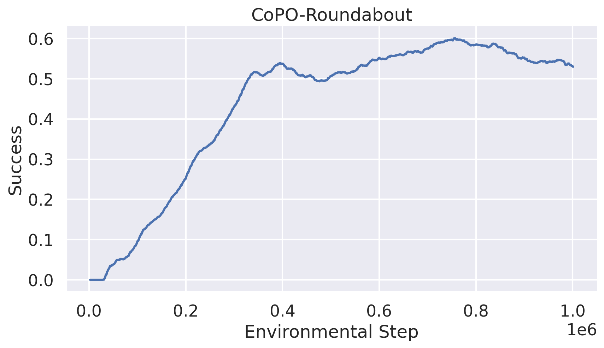

> The project mainly focuses on the problem of traffic simulation. Concretely, this problem refers to having the agents controlled by computers learn to simulate the behavior that people will do when driving in different environments. We plan to reproduce a multiagent reinforcement learning (MARL) algorithm called Coordinated Policy Optimization (CoPo) for this problem. For the method evaluation, we plan to deploy this model to a driving simulator called MetaDrive, including five typical traffic environments, and analyze the behaviors of the individuals.

<!--more-->
{: class="table-of-content"}
* TOC
{:toc}

## Description

Traffic systems can be a kind of Self-Driven Particles systems [1]. It is hard to design manual controllers for the traffic system of vehicle flow since the interactions of agents are time-varying and the environment is non-stationary in this problem [2]. The development of multi-agent reinforcement learning (MARL) in competitive multi-player games [3, 4, 5] these years appears to provide a solution for SDP. However, there are still some challenges for it. Firstly, each constituent agent in an SDP system is self-interested and the relationship between agents is constantly changing. Second, it is difficult to generate the social behaviors of the vehicle flow through a top-down design since cooperation and competition naturally emerge as the outcomes of the self-driven instinct and the multi-agent interaction. Lastly, most of the MARL methods assume that the role of each agent is pre-determined and fixed within one episode but the agent in SDP has its individual objective [1].

In this project, we will reproduce the research of Peng *et al.* [1] in the MetaDrive driving simulator [6], where they propose a novel MARL algorithm called Coordinated Policy Optimization (CoPo) for the simulation of the traffic system. This algorithm aims to control all the vehicles in the scene by operating on the low-level continuous control space. The CoPo facilitates the coordination of agents at both local and global levels.

The source code of CoPo is available at https://github.com/decisionforce/CoPO.

## Progress

### Installation

We have installed the MetaDrive according to the [MetaDrive Github README](https://github.com/metadriverse/metadrive) on Ubuntu 18.04. The Single Agent Environment and Multi-Agent Environment from different scenarios in MetaDrive are tested.

We installed CoPO and setup GPU-supported enviroment in Linux according to https://github.com/decisionforce/CoPO.

### Training

Due to the limitations of memory and computational resources on our PC, we modified the training mode to local, using single thread and removing grid search, following the instructions given in the FAQ on CoPO's GitHub page. We trained CoPO in  roundabout environment, following the example modified code for IPPO local training with GPU acceleration.

The training took about 10 hours and the training curve is shown as follow:

### Visualization

We visualize the behaviors of the populations trained by CoPO. It can be seen that the population trained with the CoPO algorithm acquires the ability of queueing, yielding, and cutting in. It is worth noticing that we decreased the number of vehicles for visualization.

### Evaluation

We evaluated the performance of trained CoPO. We utilized safety, completeness and efficiency as our metrics.

The performance shown by these metrics seems lower than expected. We plan to dive deep into the code to fix it.

## Reference

[1] Kanagaraj, Venkatesan, and Martin Treiber. "Self-driven particle model for mixed traffic and other disordered flows." *Physica A: Statistical Mechanics and its Applications* 509 (2018): 1-11.

[2] Peng, Zhenghao, et al. "Learning to simulate self-driven particles system with coordinated policy optimization." *Advances in Neural Information Processing Systems* 34 (2021): 10784-10797.

[3] Baker, Bowen, et al. "Emergent tool use from multi-agent autocurricula." *arXiv preprint arXiv:1909.07528* (2019).

[4] Kurach, Karol, et al. "Google research football: A novel reinforcement learning environment." *Proceedings of the AAAI Conference on Artificial Intelligence*. Vol. 34. No. 04. 2020.

[5] Samvelyan, Mikayel, et al. "The starcraft multi-agent challenge." *arXiv preprint arXiv:1902.04043* (2019).

[6] Li, Quanyi, et al. "Metadrive: Composing diverse driving scenarios for generalizable reinforcement learning." *IEEE transactions on pattern analysis and machine intelligence* (2022).

---
