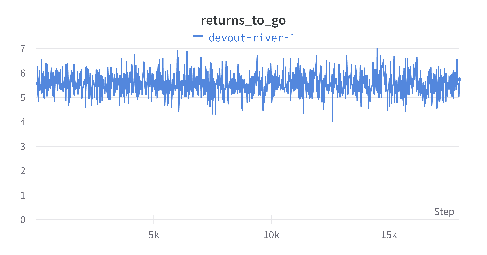
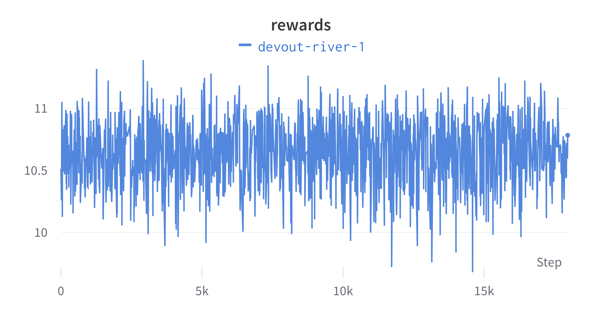
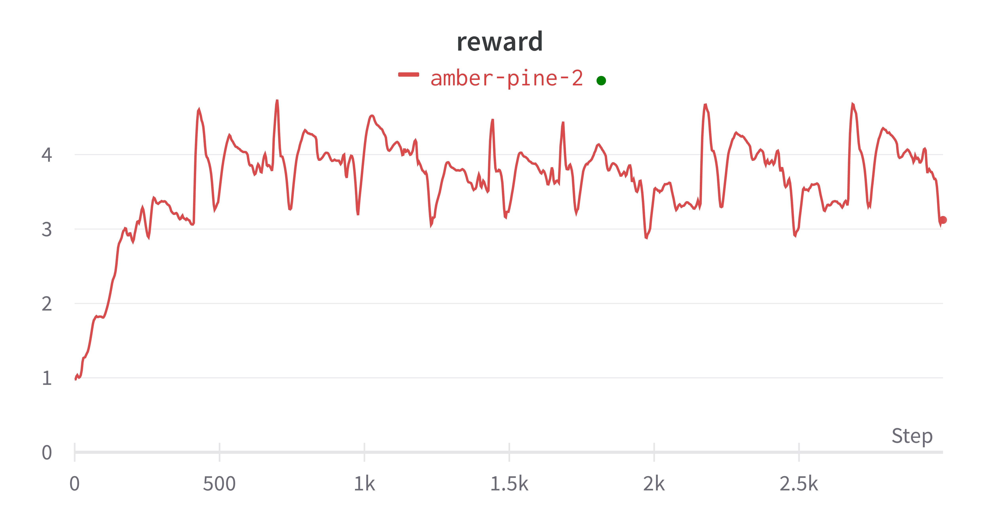

> Decision Transformers are a new type of machine learning model that enable the combination of transformers with reinforcement learning, opening up new avenues of research and application.

<!--more-->
{: class="table-of-content"}
* TOC
{:toc}

## Introduction
In this project, we will investigate Transformer in Reinforcement Learning. There is a popular model called the decision transformer which abstracts Reinforcement Learning as a conditional-sequence modeling problem. We will train an Offline Decision Transformer model from scratch to make a half-cheetah run. We will be training with the half-cheetah "expert" dataset from the huggingface hub. We also want to use a general reinforcement learning algorithm to compare with the Transformer (sequence modeling algorithm) to see the which will perform better, and why perform better.

## Background
Trajectory transformer: Trajectory transformer model was proposed in Offline Reinforcement Learning as one Big Sequence Modeling problem by Machael Janner, Qiyang Li, Sergey Levine.[2] The reinforcement learning uses high rewards to train the model. It also can regard this problem as a generic sequence modeling problem. The goal of this sequence is to generate a sequence of actions that leads to a sequence of high rewards. Therefore, tools of sequence modeling can deal with the reinforcement learning problems. "By using a transformer architecture to model distributions over trajectories and repurposing beam search as a planning algorithm."[2] Furthermore, this algorithm is flexible in long-horizon dynamics prediction, imitation learning etc. If the rewards of the model are low or unclear(long-term credit assignment), this algorithm always works efficiently.

Decision transformer: The Decision Transformer is reinforcement learning through sequence modeling. It converts reinforcement learning as a conditional sequence modeling problem. Does not like traditional reinforcement learning methods such as fitting a value function or gradient descent which takes action to maximize the cumulative rewards. Decision Transformer is through a casually masked Transformer to give an optimal output. It is an autoregressive model which means it will take current state, past state, and action as input next time input, and after iteration will have an output sequence that is future actions, and it will approach to desire returns. 

"This is a complete shift in the Reinforcement Learning paradigm since we use generative trajectory modeling (modeling the joint distribution of the sequence of states, actions, and rewards) to replace conventional RL algorithms."[1] Instead of using the bellman equation as the traditional method which value iteration can be very slow, decision transformer will work more efficiently than traditional reinforcement learning algorithm if there are sparse or distracting rewards.

## Methodology

### Dataset
We train the model with the halfcheetah expert dataset. To load the dataset, we first import load_dataset function from the datasets package and then directly load the dataset by the branch name "halfcheetah-expert-v2". 

Before the training, we apply the following data-preprocessing to the dataset:

1. Normalize each feature by taking away the mean and dividing by the standard deviation.
2. For each trajectory, compute the discounted returns in advance.
3. Increase the rewards and returns by 1000 times.
4. Augment the dataset sample distribution.

To perform the data preprocessing, we create a class that takes the dataset as input, performs the preprocessing steps, and then provides us with batches of states, actions, rewards, returns, timesteps, and masks. The Decision Transformer model can directly use these batches to train.

### Trainer class
Huggingfaces also introduces a class called Trainer, which provides API in PyTorch. The API can be used to perform distributed training on multiple GPUs or TPUs and contains the basic training loop. We use the Trainer class to train our transformer model.

### Train the model
We create a class that inherits from the Decision Transformer model. The forward function in this class returns a loss, which is the L-2 norm of the model action predictions and the truth.
After trying different combinations of hyperparameters, we choose the following: 
1. num_train_epochs=120,
    2. per_device_train_batch_size=64,
    3. learning_rate=1e-4,
    4. weight_decay=1e-4,
    5. warmup_ratio=0.1,
    6. max_grad_norm=0.25,

The current setting uses about 40 minutes to train. We found that by training for more iterations, the performance of the model will be increased. Therefore, we can set the num_train_epochs to be a larger amount and train the model (~3 hours).

## Results

### Training Rewards

The training results of our experiments are shown in the following charts. We trained the model for 6k steps. As shown in the loss chart, it decreases from > 0.05 to 0.01 within 1000 steps. Then the improvement is not very obvious when the training steps increases. While the return to go and reward didn't have a clear sign of increase or decrease. One explaination is that in Decision Transformers, we don’t need to maximize the return. Instead, we generate a series of  actions that achieve the maximum return we expect.

### Video Demo

<video width="320" height="240" controls>
  <source src="../assets/images/team14/hopper.mp4" type="video/mp4">
</video>

<video width="320" height="240" controls>
  <source src="../assets/images/team14/cheetah.mp4" type="video/mp4">
</video>

## Future work
We have trained a Decision Transformer using the halfcheetah dataset, our next step is to analysis the results statistically and potentially improve the overall performance. We would like to compare the current performance with that of other RL algorithms. Furthermore, we want to support more complex cases by adopting Decision Transformers and explore more RL environments.

## Reference
[1] Chen, Lili, et al. "Decision transformer: Reinforcement learning via sequence modeling." Advances in neural information processing systems 34 (2021): 15084-15097.

[2] Michael Janner, Qiyang Li and Sergey Levine. "Offline Reinforcement Learning as One Big Sequence Modeling Problem." Advances in Neural Information Processing Systems (2021).

---

