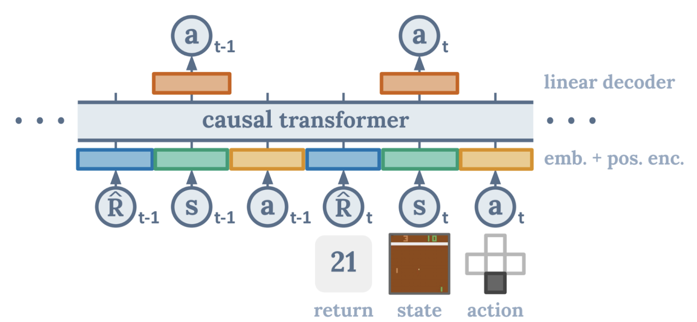
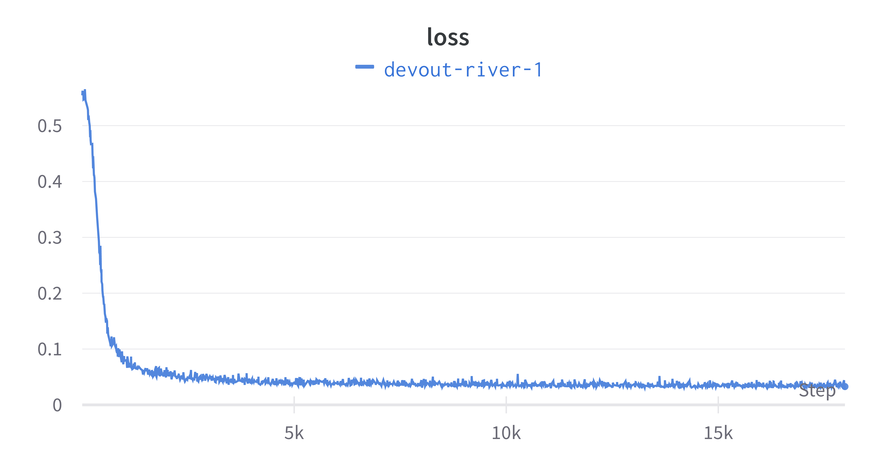
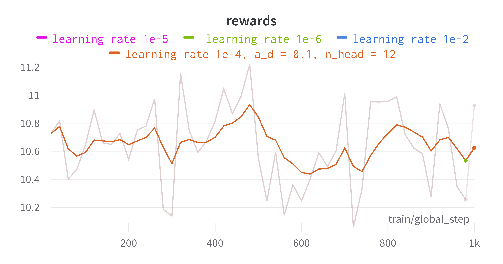
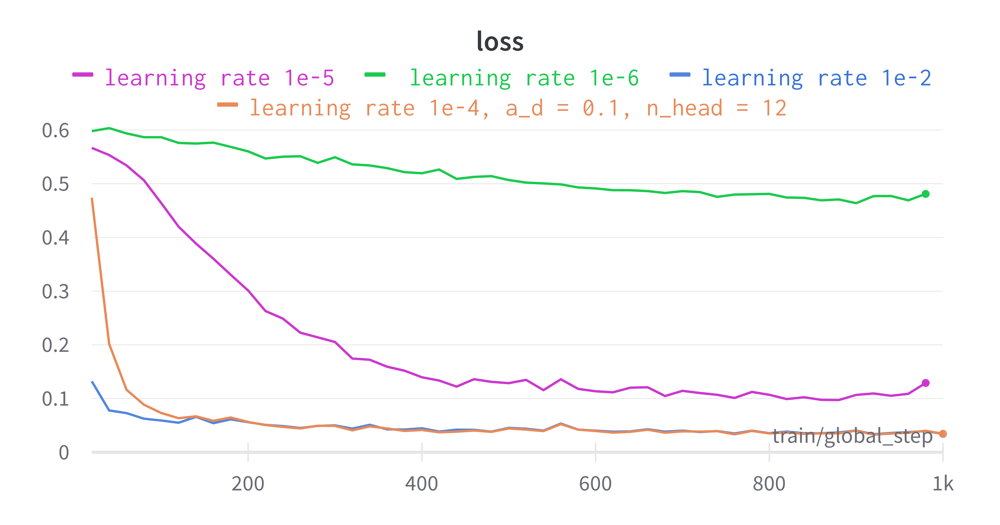
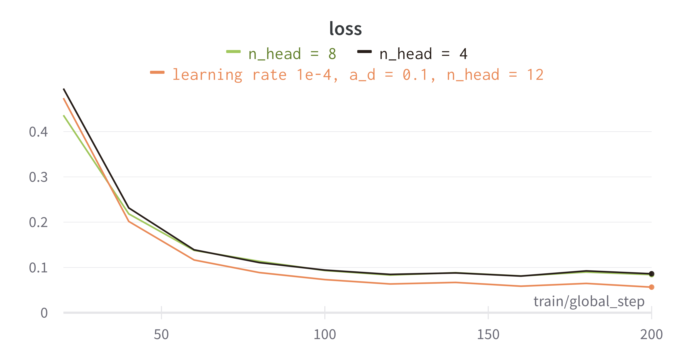
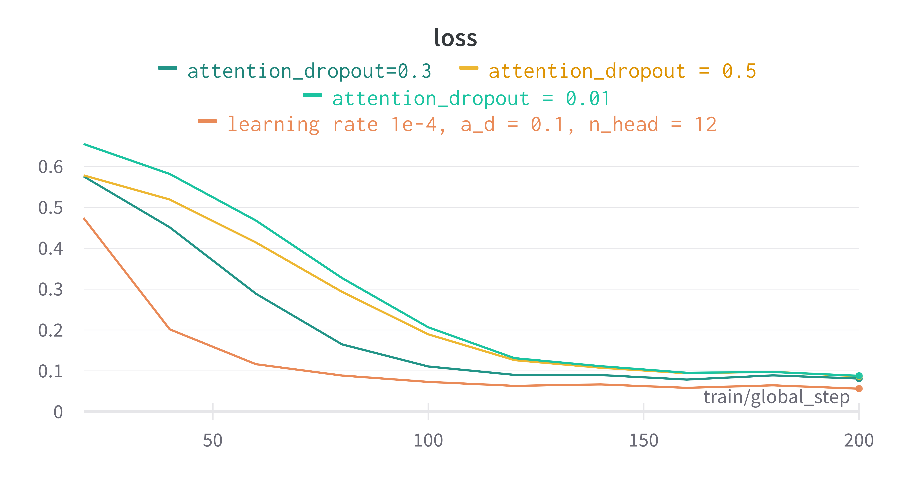
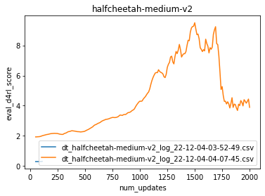

> Decision Transformers are a new type of machine learning model that enable the combination of transformers with reinforcement learning, opening up new avenues of research and application.

<!--more-->
{: class="table-of-content"}
* TOC
{:toc}

## Introduction
In this project, we will investigate Transformer in Reinforcement Learning. There is a popular model called the decision transformer which abstracts Reinforcement Learning as a conditional-sequence modeling problem. We will train an Offline Decision Transformer model from scratch to make a half-cheetah run. We will be training with the half-cheetah "expert" dataset from the huggingface hub. We also want to use a general reinforcement learning algorithm to compare with the Transformer (sequence modeling algorithm) to see the which will perform better, and why perform better.

## Background
Trajectory transformer: Trajectory transformer model was proposed in Offline Reinforcement Learning as one Big Sequence Modeling problem by Machael Janner, Qiyang Li, Sergey Levine.[2] The reinforcement learning uses high rewards to train the model. It also can regard this problem as a generic sequence modeling problem. The goal of this sequence is to generate a sequence of actions that leads to a sequence of high rewards. Therefore, tools of sequence modeling can deal with the reinforcement learning problems. "By using a transformer architecture to model distributions over trajectories and repurposing beam search as a planning algorithm."[2] Furthermore, this algorithm is flexible in long-horizon dynamics prediction, imitation learning etc. If the rewards of the model are low or unclear(long-term credit assignment), this algorithm always works efficiently.

Decision transformer: The Decision Transformer is reinforcement learning through sequence modeling. It converts reinforcement learning as a conditional sequence modeling problem. Does not like traditional reinforcement learning methods such as fitting a value function or gradient descent which takes action to maximize the cumulative rewards. Decision Transformer is through a casually masked Transformer to give an optimal output. It is an autoregressive model which means it will take current state, past state, and action as input next time input, and after iteration will have an output sequence that is future actions, and it will approach to desire returns. 

<figure align="center">

<figcaption align="center">1. Decision Transformer Model</figcaption>
</figure>

"This is a complete shift in the Reinforcement Learning paradigm since we use generative trajectory modeling (modeling the joint distribution of the sequence of states, actions, and rewards) to replace conventional RL algorithms."[1] Instead of using the bellman equation as the traditional method which value iteration can be very slow, decision transformer will work more efficiently than traditional reinforcement learning algorithm if there are sparse or distracting rewards.

## Methodology

### Dataset
We train the model with the halfcheetah expert dataset. To load the dataset, we first import load_dataset function from the datasets package and then directly load the dataset by the branch name "halfcheetah-expert-v2". 

Before the training, we apply the following data-preprocessing to the dataset:

1. Normalize each feature by taking away the mean and dividing by the standard deviation.
2. For each trajectory, compute the discounted returns in advance.
3. Increase the rewards and returns by 1000 times.
4. Augment the dataset sample distribution.

To perform the data preprocessing, we create a class that takes the dataset as input, performs the preprocessing steps, and then provides us with batches of states, actions, rewards, returns, timesteps, and masks. The Decision Transformer model can directly use these batches to train.

### Trainer class
Huggingfaces also introduces a class called Trainer, which provides API in PyTorch. The API can be used to perform distributed training on multiple GPUs or TPUs and contains the basic training loop. We use the Trainer class to train our transformer model.

### Train the model
We create a class that inherits from the Decision Transformer model. The forward function in this class returns a loss, which is the L-2 norm of the model action predictions and the truth.
After trying different combinations of hyperparameters, we choose the following: 
1. num_train_epochs=120,
    2. per_device_train_batch_size=64,
    3. learning_rate=1e-4,
    4. weight_decay=1e-4,
    5. warmup_ratio=0.1,
    6. max_grad_norm=0.25,

The current setting uses about 40 minutes to train. We found that by training for more iterations, the performance of the model will be increased. Therefore, we can set the num_train_epochs to be a larger amount and train the model (~3 hours).

## Results

### Training
We want to explore the relationship between the model's performance and the training hyperparameters by conducting the following experiments. These charts are training results from Halfcheetah dataset. We also did experiments in Hopper dataset, which will be explained in the evaluation section. Since the Decision Transformer is an offline reinforcement learning model, we only have access to a fixed, constrained dataset made up of trajectory rollouts of random policies rather than obtaining data through environment interactions. Therefore, we cannot observe the change of reward, returns to go as training goes. The only thing that could represents the training process is the loss as shown in the fllowing figure.
<figure align="center">

<figcaption align="center">2. Loss to train Halfcheetah with 20k steps</figcaption>
</figure>

We trained the Decision Transformer model using Halfcheetah for 20k steps. As shown in image 2, it decreases from > 0.05 to 0.01 within 1000 steps. Then the improvement is not very obvious when the training steps increases.

<figure align="center">

<figcaption align="center">3. Returns to go in Halfcheetah</figcaption>
</figure>

<figure align="center">

<figcaption align="center">4. Rewards to go in Halfcheetah</figcaption>
</figure>

While the Image 3. return to go and Image 4. reward didn't have a clear sign of increase or decrease. As mentioned before, since the Decision Transformer is an offline reinforcement learning model, we only have access to a fixed, constrained dataset made up of trajector. And in Decision Transformers, we don’t need to maximize the return. Instead, we generate a series of  actions that achieve the maximum return we expect. Therefore, as shown in the above returns to go and reward charts, the data didn't increase as expected in other online Reinforcement Learning Algorithms. Different learning rates didn't affect the reward and return to go.

<figure align="center">

<figcaption align="center">5. Loss under different learning rates in Halfcheetah</figcaption>
</figure>

We tried to understand the relation between the learning rate and the training loss. After conducting experinents in different seeting of learning rates: 1e-6, 1e-5, 1e-4, 1e-2. The results of the first 1k stpes are shown in the chart. We found that learning rate with too small, e.g. 1e-6, converges really slowly. Learning rates at 1e-4 and 1e-2 both converges fast and the final results look reasonable. The reason of this situation is straightforward. Because you are making small adjustments to the weights in the network, training will advance very slowly if the learning rate is set too low. On the other hand, the loss function may show undesirable divergent behavior if the learning rate is set too high. In our experiments, we didn't observe ndesirable divergent behavior in the loss function. Using learning rate 1e-2 outperformes other learning rates.

<figure align="center">

<figcaption align="center">6. Loss under different number of heads in Halfcheetah</figcaption>
</figure>

Since we are adopting Transformer in RL, we are more curious about its unique properties. In the Transformer, the Attention module repeats its computations multiple times. Each of these is called an Attention Head, which means changing the number of heads changes the number of parameters to learn during the training. Therefore, we have the following assumptions:
1. If the model has more heads, the training will cost longer time.
2. The model can learn different patterns with more heads.

After we conducted the experiments with respect to the number of attention heads in Transformer, we got the above chart. We tried number of head = 4, 8, 12. Despite the difference in the numbers, the behaviours of the loss didn't show a big difference. Model with 12 heads performs slightly better than others. One of the reasons may be that the environment we use is relatively simple: training a halfcheetah to run. When we have more heads per layer in Transformer, the model can learn more patterns with each of these heads. For example, one head may pay attention to the previous word and one head may pay attention to the time and date. The current environments of Halfcheetah may not require so many number of heads. If we need to train a more complex agent, a large number of heads may be preferred. 

By doing research on Transformer, we also found that some of the heads are not useful sometimes. Therefore, we can train a model with multiple heads then prune away useless heads. We believe this could be a direction of improving the performance of Decision Transformer.

<figure align="center">

<figcaption align="center">7. Loss under different attention_dropout in Halfcheetah</figcaption>
</figure>

We also want to find the relation between dropout ratio and the training speed. The process of dropouts is to ignore units during the training phase randomly. In Transformer, Attention Dropout is when elements are randomly dropped out of the softmax in the attention equation. The reason we need dropouts is to prevent over-fitting. Roughly speaking, If the 50% of the elements are dropped out, the number of iterations required to converge doubles. In the meanwhile, training time for each epoch is less. As shown in the attention_dropout chart, We tried attention dropouts of 0.01, 0.1, 0.3. 0.5. The model with 0.1 attention droptout converges fastest. Attention dropout of 0.5 is even slower than attention dropout of 0.3. Currently, we havvn't figure out a reason to explain the behaviors. If we have a validation set, we can compare the affect of the dropout ratio on the training accuracy and validation accuracy.

### Video Demo

Below are the video demos of our training results. We trained in two environments: Halfcheetah and Hopper using Decision Transformer.

https://user-images.githubusercontent.com/42762117/205182315-1221082f-56aa-4f4a-94aa-c21d1687954c.mp4

https://user-images.githubusercontent.com/42762117/205182089-231474ff-a6a6-49bd-ab95-6df78edf05de.mp4

### Evaluation

 Currently we trained the model for 2k stpes and the training time is ~90min. The charts below can be used as rough reference points to measure the learning progress of the model.

<figure align="center">

<figcaption align="center">8. Evaluation in Hopper</figcaption>
</figure>

<figure align="center">

<figcaption align="center">9. Evaluation in Halfcheetah</figcaption>
</figure>

## Future work
We have trained a Decision Transformer in the halfcheetah and hopper environment, our next step is to analysis the results statistically and potentially improve the overall performance. We would like to compare the current performance with that of other RL algorithms. Furthermore, we want to support more complex cases by adopting Decision Transformers and explore more RL environments.

## Reference
[1] Chen, Lili, et al. "Decision transformer: Reinforcement learning via sequence modeling." Advances in neural information processing systems 34 (2021): 15084-15097.

[2] Michael Janner, Qiyang Li and Sergey Levine. "Offline Reinforcement Learning as One Big Sequence Modeling Problem." Advances in Neural Information Processing Systems (2021).

---

