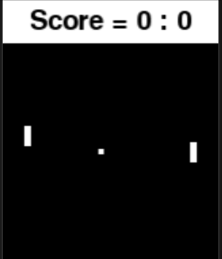
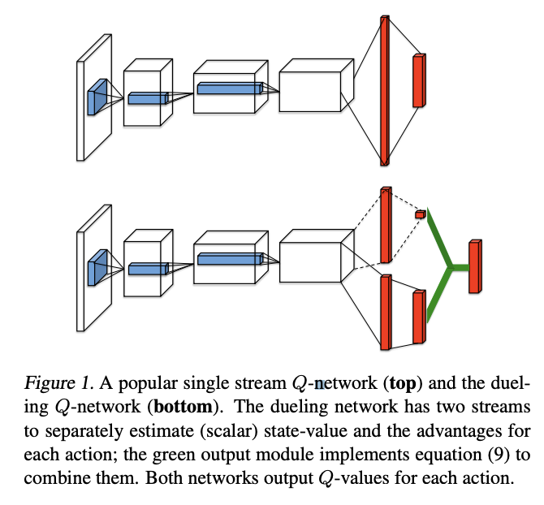
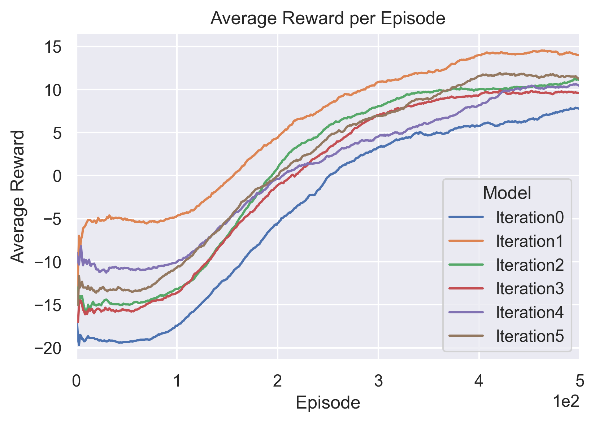
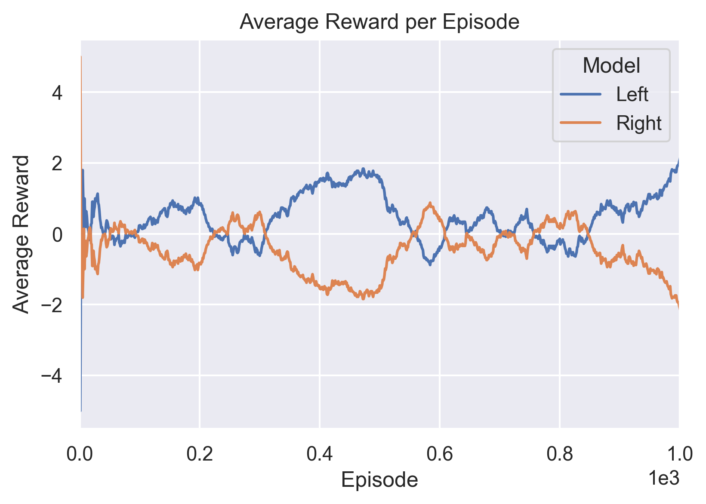
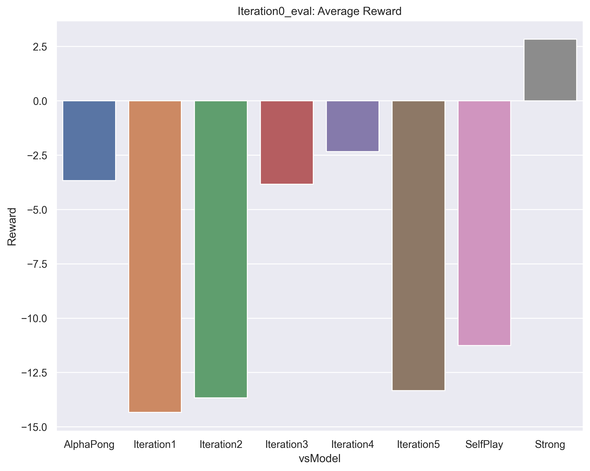
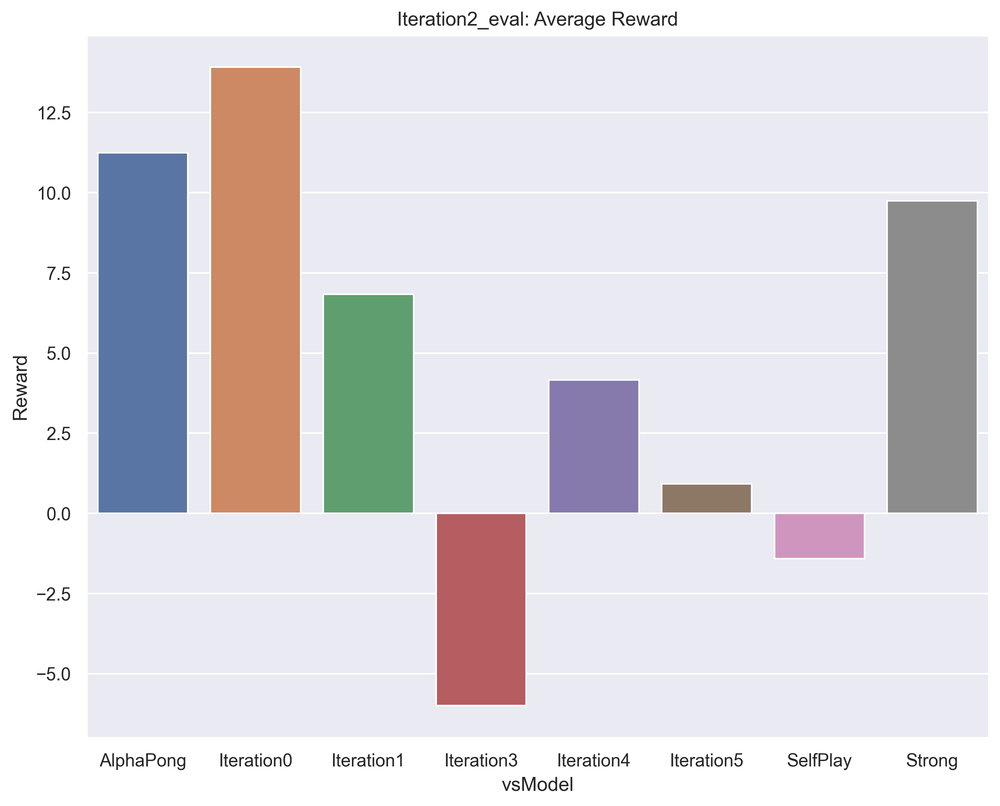
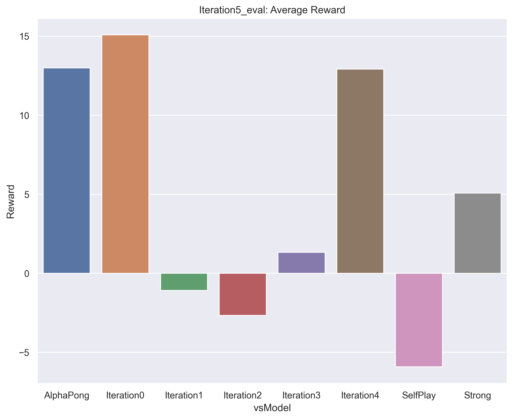
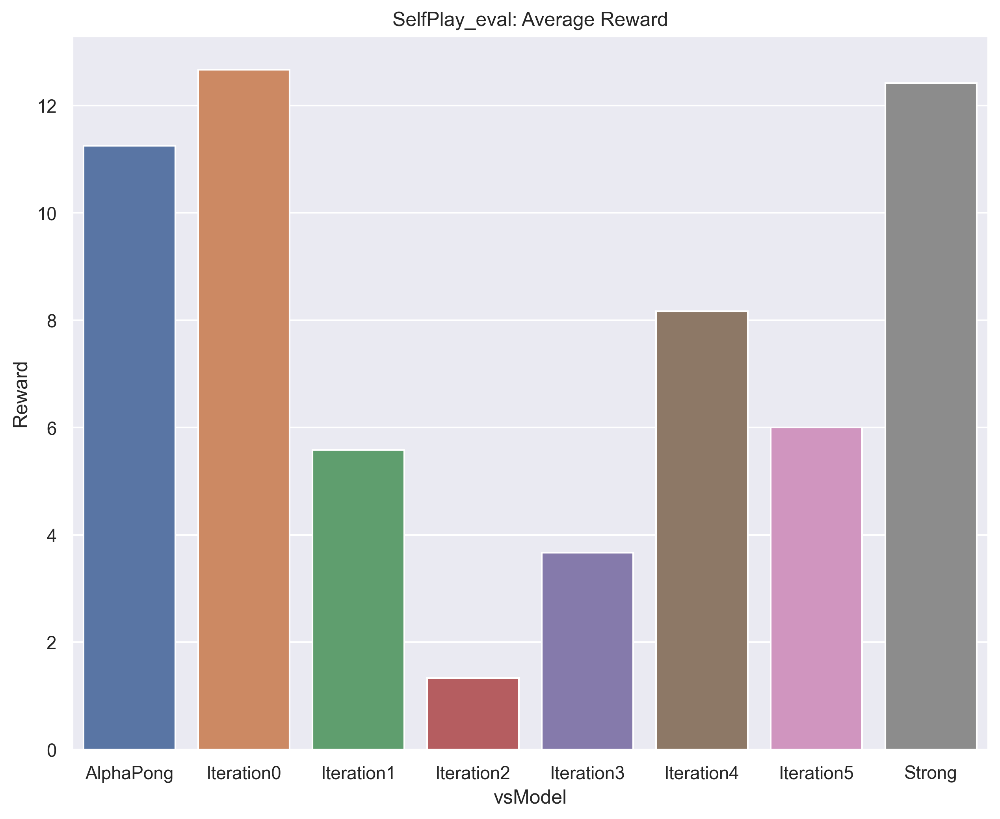

# Multi-Agent Competitive Self-play with Pong

## Abstract

Multi-agent reinforcement learning, in which multiple agents are trained in a single, interactive environment, has been demonstrated to develop interesting and novel behaviors. Competitive self-play is a form of multi-agent RL in which multiple versions of a single agent play competitively against each other in order to improve performance iteratively. In our research, we focused on a self-play model of reinforcement learning for the Atari game Pong. We employed deep Q-learning with a dueling convolutional neural network architecture, and experimented with a variety of training methods for our agents. We studied iterative improvement by training an agent against a static rule-based agent, and then freezing its training while we trained a new agent against our first trained agent, and repeated this process for several training cycles. We also experimented with full self-play in which two agents train against each other simultaneously while competing at Pong. Our research demonstrated that this full self-play model widely outperformed the iterative training model, even after a sequence of five iterative training cycles. This demonstrates the unique learning properties of live self-play in a competitive multi-agent environment like Pong.

## Presentation Video

<LINK TO DEMO>

## Introduction

### Goal

Multi-agent reinforcement learning can be used to train agents in a variety of environments, both competitively and cooperatively. Self-play for improving the performance of competitive agents has been exercised to great success in recent years, particularly by DeepMind, who have achieved historic success in competitive gameplay in games such as chess, shogi, and, notably, go. We focus on the specific case of competitive play in Atari pong. 

The goal of our training was to develop the strongest playing agent that we could. We wanted to explore which multi-agent training methodologies would improve our agent the fastest, as well as which would lead ultimately to the best quality of play.

### Environment

The game Pong consists of two players. Each player controls a paddle that can move up or down. A ball is bounced between the two players until one of them scores a point by getting the ball past their opponent's paddle. The objective is to have the highest possible score after 21 points. The winner is the player with the most points after 21 points have been played. 

We used the `gym` environment in the `competitive_rl` library. The observation space was a 3 channel RGB frame with a width of 160 and a height 210 pixels. Each episode in the environment consists of a full best-of-21 game between the two players. The reward for this episode for each agent is that agents score minus their opponent’s score. For example, if the left agent loses 10 to 11, its reward for that episode is -1. If an agent wins 20 to 1, its reward is 19. Therefore, the maximum possible episode reward is 21 and the minimum is -21.

## Related Work

We based much of the experimentation and methods in this project on two research papers which are listed here. The first paper provided a useful framework for how to experiment with multi-agent self play for Pong. The second paper provided a practical implementation of DQN using a Dueling CNN architecture which proved extremely fruitful in training.

Multiagent cooperation and competition with deep reinforcement learning
https://journals.plos.org/plosone/article?id=10.1371/journal.pone.0172395

Dueling Network Architectures for Deep Reinforcement Learning
https://arxiv.org/abs/1511.06581

## Methodology

### Algorithm

Initially, we experimented by training a simple three layer CNN-based DQN model. This was an implementation of deep Q-learning which used the three-layer CNN to model the weights of the value function and target value function. This proved to be extremely slow at training and the resulting quality of the agent was not particularly strong.

We then pivoted to using DQN with a Dueling CNN architecture. In a Dueling CNN model, the neural network has separate branches for the state values and advantage values, where the advantage represents the value of taking a specific action in a given state which is normalized by the average of all action values for that state. These can then be summed to produce a final score for the state. We employed this algorithm for the training of all our subsequent agents to much greater success than the original DQN model. The above diagrams come from the linked research paper. The first diagram illustrates the splitting at the end of the neural network that produces the value and advantage scores. This Dueling CNN method has been proven to perform better in Atari games[1].

### Training

We studied two methods of training for competitive self-play, which we refer to as “iterative” and “full self-play”. 

The iterative method involved training a fresh agent against the rule-based agent built into the Pong environment, which is modeled after the behavior of the automated agent in the original Atari game. On the next iteration, the newly trained agent has its training frozen and then used as an opponent to train a new agent. This process is repeated iteratively. We trained five iterative agents for between 500 and 1200 episodes. For each training, we ended the training process when the average episode reward stopped improving. By the end of training, each subsequent agent was able to beat the previous agent with an average episode reward of ~12.

The full self-play method involved training two fresh agents against each other simultaneously. Because they both started from the same tabla rasa initial state, neither of the two agents ever achieved the upper hand over the other agent through the training process. We continued training for around 1200 episodes.

I want to mention a few details and optimizations we used. In training, we employed epsilon decay, so that the agent’s propensity for exploration slowly reduced over the course of training. It started at 100% chance of taking a random action and slowly reduced, so that by the time the agent had played 1200 episodes it’s chance of performing a random, rather than a trained, action was about 5%.

We also employed a few optimizations. First, we converted the three channel frame into one channel grayscale. We also used frame stacking. This involved saving a sequence of old states so that the CNN could be trained on a set of sequential states at each step, thereby learning more about the dynamic properties of the game, as well as improving training efficiency. We used a frame stack depth of 4. One optimization we did not use was reducing the size of the frame. We trained on a 160x210 frame. This is an optimization that was used in the training of some of the agents in the `competitive_rl` library, but we did not attempt this in our research.

We also encountered a few bugs in the environment worth mentioning. The most notable was that sometimes the ball would pass through the paddle rather than bouncing off it. The most obvious time that this occurs is when the paddle is all the way up at the top or bottom. In that case, even a direct hit to the paddle would not bounce off the paddle but would go straight through it. We do not have a good understanding of if our agents were able to identify and exploit this bug. 

### Computational Limitations

In training we struggled initially with some computation limitations. We were training on personal computers and were limited by the length of the training times which would always take 6 or more hours, as well as, in my case, the lack of a GPU.

We eventually deployed a virtual machine in Google Compute Engine that was supported by a Tesla K80 GPU, in order to expedite training. This was both so we could avoid having to use our personal machines and to have access to an ML-focused GPU.

## Evaluation

We first look at the training of each model with the iteration method. The below graph shows the average reward (over last 100 episodes) as we trained each interative agent against the previous agent. Iteration0 is the agent trained against the built-in rule-based opponent. Note that the rewards shown are averages; the actual reward varies quite a lot per episode. In some cases, some of the better agents actually do achieve several 21 point-reward perfect games. Further, this graph shows that the training began to improve in all cases at around 100 episodes and then improved steadily until ultimately plateauing at around 300 to 400 episodes. Part of the reason for this plateauing could be explained by epsilon decay; this will be discussed further in the next section.

As can be seen in the training above, iterative agents were successful against previous agents but not particularly strong overall. Below, we will look at how they competed more generally.

Training of full self-play is shown below. Observe the flat net reward growth as they both improve over time. Neither gains the upper hand.

Next, as we turn to competetive evaluation, we must note here an issue we encountered. We found that most of our agents, even the weakest ones, competed very well against both the provided "strong" and "alphapong" agents. We suspect the cause is that the way these agents were trained is different from ours. They used a downsized frame for training while we used the full frame, so in evaluation we had to run the full frame version and then call a frame resizing on each state before passing it to their action function. We think somewhere in this state handling there is a bug that leads to them having weaker performance. Nonetheless, we include them in our evaluations as a reference point.

Below shows how iteration0, our weakest agent, competed against a series of different models. Not shown is that it competed very well against the rule-based opponent, as this is what is was directly trained against. Also, note that there is a dip in the strength of our middle agents 3 and 4. Illogically, these don't compete as well against the initial agent. A possible explanation is in the next section.

Here we show the results of iteration2. As expected, it competes very well against iteration1 and poorly against iteration3.

Next is the evaluation for the final trained iterative agent. As you can see, it naturally competes very well against iteration4, the agent it was trained against. But it is less impressive against the other agents. This demonstrates the weakness of the iterative method of training. More explanation below.

Finally, the full self-play agent was our strongest agent, as can be seen in the results below.

## Conclusions

The largest conclusion we drew is that pure-self play is better than our iterative method. Freezing a previous agent as an opponent against which to train a fresh agent provides a target threshold of ability to beat, but also puts a limit on the potential growth of that agent. It can only gain so much skill against the static opponent. Training these agents iteratively was also a slow process, so it would take a long time for this iterative improvement to reach high levels of play.

Iterative play had other problems as well. As the training agent improved, it learned to exploit particular weaknesses in the previous agent, but these tactics didn’t tend to generalize well. Because the opponent is static, it could not adapt to these new strategies and therefore they became more deeply ingrained in the behavior of the agent that was being trained. This can be seen in the fact that of all our iterative agents, the one that competed best against the built-in rule-based agent was the one that was trained directly against it, even though that was the first agent we trained. Even iteration 5, the final, and best, of all the iteratively-trained agents, didn't perform as well against rule-based as the first agent trained directly against it. Each iterative agent was optimized to compete with the agent before it, but did not demonstrate the general skill necessary for an arbitrary opponent.

Some of these issues could explain why the middle agents iteration3 and iteration4 are so different. They are weak against iteration0 but better against later agents. Of course, each compete well against the agenet they are trained against, but they don't have good generalized strategies. This is the kind of problem that can occur when interacting randomly in a complex environment without an ideal leaning strategy. The frozen opponent limits their development.

In full self-play, however, we saw a much better quality of play. For one thing, full self-play does not cap the maximum skill that can be acquired through training. Because they are both improving as the training continues, they both develop new strategies as well as learning to adapt to the strategies of their opponent. Therefore, the ceiling on their level of play was essentially unlimited. More advanced strategies could be developed as the training continued longer. This form of training resulted in far stronger agents overall.

Anotyher thing to note. In all training, we saw a plateau in the improvement overtime. We posited that for the iterative case, this is due in part to the cap on learned ability when facing a frozen opponent. But this could also be explained by the epsilon decay. These agents simply stop exploring as much as they train longer. This is an issue in self play as well as iterative training.

## Future Work

The first obvious step for future work is to improve our training speed. We should downsize the frame to 42x42 as the pre-trainined agents in `competitive_rl` do. There are other optimizations we can employ as well.

We could also improve my spending more time on hyperparameter tuning, which can be a time consuming but valuable process. In particular, we could adjust epsilon decay, so exploration happens for longer into the training process. We could experiment with lowering epsilon late in the process as well. This might be particularly useful in the self-play training where we have no cap on learned ability.

It would also be interesting to explore a new training method of iterative full self-play, sort of part way between the two methods we tried. We would still use the full self-play method of having both agents training at the same time, but we could stagger their versions, so that a more heavily trained later model competes against a slightly older model. This could allow for more diversity of play, as we won't have two identical agents competing. This might improve exploration and lead to new and intersting strategies.

Antoher interesting follow-up might be adjusting the reward model of the environment to encourage cooperation. This could lead to behaviors where longer rallies are present. If we then switched them back to competetive, the agent might have acquired some otherwise hard to discover skills.

Finally, we could also explore the use of other training algorithms such as PPO or some Actor-Critic variants.

## References

### Key papers

[1] Multiagent cooperation and competition with deep reinforcement learning https://journals.plos.org/plosone/article?id=10.1371/journal.pone.0172395

[2] Dueling Network Architectures for Deep Reinforcement Learning https://arxiv.org/abs/1511.06581

### Papers we also looked at:

[3] Emergent Complexity via Multi-Agent Competition:
https://arxiv.org/pdf/1710.03748.pdf

[4] Exploration-Exploitation in Multi-Agent Competition: Convergence with Bounded Rationality:
https://proceedings.neurips.cc/paper/2021/file/dd1970fb03877a235d530476eb727dab-Paper.pdf

[5] Improving Q-Learning with Functional Regularization:
https://arxiv.org/pdf/2106.02613.pdf

[6] Multi-Agent Actor-Critic for Mixed Cooperative-Competitive Environments:
https://proceedings.neurips.cc/paper/2017/file/68a9750337a418a86fe06c1991a1d64c-Paper.pdf